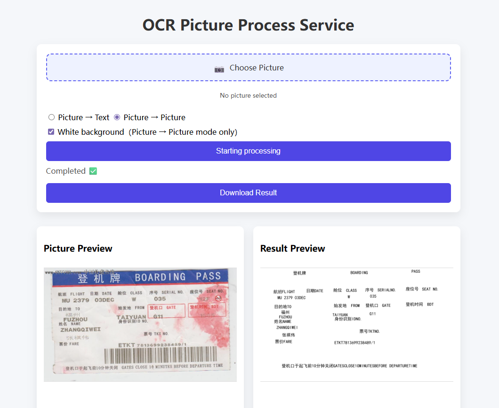

# OCR Picture Process Service

A web-based OCR processing service built with **Flask** and **PaddleOCR**, supporting both **Image → Text** and **Image → Image** workflows. The service is optimized for production usage with **cold start mitigation**, **model warm-up**, and **result caching** to ensure stable and efficient performance.

---

## Features

- 📄 **Image → Text**
  - Extracts text from images
  - Preserves basic layout information
  - Outputs downloadable `.txt` files

- 🖼️ **Image → Image**
  - Renders recognized text back onto images
  - Optional white background mode
  - Produces clean, readable output images

- ⚡ **Performance Optimizations**
  - Cold start handling
  - Model warm-up
  - OCR result caching

- 🌐 **Web Interface**
  - Safari / Chrome compatible
  - Image upload with preview
  - Result preview and download

---

## Tech Stack

- **Backend**: Flask
- **OCR Engine**: PaddleOCR
- **Frontend**: HTML + CSS
- **Deployment**: Reverse-proxy ready (ProxyFix enabled)

---

## Architecture Overview

```
Client (Browser)
   │
   ▼
Flask Web Server
   │
   ├── Image Upload
   ├── OCR Processing (PaddleOCR)
   ├── Result Cache
   └── File Download
```

---

## API Endpoints

### `GET /`
Web UI entry point.

---

### `POST /img_txt`
**Image → Text**

- **Request**: `multipart/form-data`
  - Field: `image`

- **Response**:
  - Downloadable `.txt` file

- **Description**:
  - Performs OCR and exports text with basic layout awareness.

---

### `POST /img_img`
**Image → Image**

- **Request**: `multipart/form-data`
  - Field: `image`
  - Optional:
    - `white_background=true | false`

- **Response**:
  - Downloadable processed image

- **Description**:
  - Draws OCR-recognized text directly onto an output image.


---

## Performance Optimizations

### Cold Start Mitigation

OCR models such as PaddleOCR are expensive to initialize. This service reduces cold start latency by:

- Loading OCR dependencies at application startup
- Avoiding repeated model initialization per request

This significantly improves the response time of the first request after deployment or scaling.

---

### Model Warm-up

A warm-up strategy is applied to ensure the OCR model is fully initialized before serving user traffic:

- The model is triggered during early runtime
- Prevents the first user request from paying the full initialization cost

This is especially important in containerized or auto-scaling environments.

---

### Result Caching

To improve throughput and reduce redundant computation:

- OCR results are cached when possible
- Repeated processing of the same image avoids unnecessary OCR runs
- Reduces CPU/GPU usage and improves overall responsiveness

---

## Project Structure

```
.
├── ocr.py
├── utility.py
├── uploads/        # Uploaded images
├── output/         # OCR results
├── templates/
│   └── index.html
├── static/
│   └── style.css
└── README.md
```

---

## Running the Service

```bash
python ocr.py
```

The service will be available at:

```
http://0.0.0.0:5001
```

---

## Deployment Notes

- Designed to work behind a reverse proxy (e.g., Nginx)
- `ProxyFix` is enabled for proper header handling
- Suitable for Docker and cloud deployment

---

## Example Use Cases

- Document digitization
- Ticket and receipt OCR
- Image-based text extraction
- OCR preprocessing pipelines

---

## License

This project is intended for educational and internal use.
Please ensure compliance with PaddleOCR’s license for commercial deployment.

